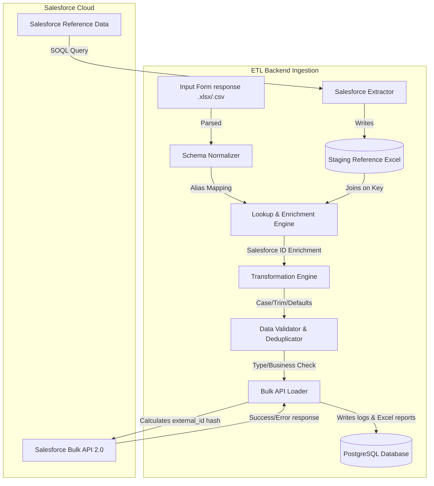

# Automated Salesforce ETL & Data Integration Service

A production-ready, configuration-driven ETL platform designed to align heterogeneous external form response schemas, perform master dataset lookups, enrich rows with Salesforce reference IDs, apply custom business validation rules, and upsert finalized records back into Salesforce using the **Bulk API 2.0**.

---

## 1. DATA FLOW ARCHITECTURE

The service orchestrates data transformation pipelines through a series of decoupled components:



---

## 2. REPOSITORY FOLDER STRUCTURE

```text
salesforce-etl-platform/
├── backend/
│   ├── app/
│   │   ├── api/routes/          # health, jobs, configurations, executions, files
│   │   ├── core/                # settings, config manager, logging
│   │   ├── database/            # SQLAlchemy db setup, schema models
│   │   ├── etl/                 # extractor, transformer, validator, enricher, loader, pipeline
│   │   ├── forms/               # parsing and alias normalizer
│   │   ├── scheduler/           # APScheduler background cron scanner
│   │   ├── utils/               # file parsing (Pandas), MD5 hashing
│   │   ├── cli.py               # CLI entrypoint
│   │   └── main.py              # FastAPI server entrypoint
│   ├── tests/                   # Pytest test suite
│   ├── Dockerfile
│   └── requirements.txt
├── frontend/
│   ├── src/
│   │   ├── components/
│   │   ├── services/            # Axios API caller
│   │   ├── types/               # TypeScript interfaces
│   │   ├── App.tsx              # Main React Admin Console Dashboard
│   │   └── index.css            # Tailwind directive styles
│   ├── Dockerfile
│   ├── tailwind.config.js
│   ├── postcss.config.js
│   └── package.json
├── config/                      # YAML files defining business rules (Salesforce SOQL, aliases, cron schedules)
├── data/                        # Local files directory (uploads, staging, error reports, archives)
├── sample_data/                 # Predefined spreadsheets for dry-run verification
├── docker-compose.yml           # Multi-container orchestration
└── README.md
```

---

## 3. CORE FEATURES

1. **Config-Driven Aliases**: Adding a country form does not require rewriting python scripts; simply register column alias patterns in `config/field_mappings.yaml`.
2. **Idempotency Guard**: Re-uploading files is blocked or warned against using MD5 content hashing. Rows are assigned SHA-256 hashes generated from duplicate keys to act as Salesforce upsert keys.
3. **Robust Separation of Concerns**: Valid rows are uploaded to Salesforce, while failed lookup or validation rows are logged to the database and exported to standalone error spreadsheets (e.g. `validation_errors_exec_xxxx.xlsx`).
4. **Mock Mode Integration**: Enable `MOCK_SALESFORCE=true` to test the entire ingestion process (SOQL extraction mock, Bulk API mock, error routing) without requiring a Salesforce instance.

---

## 4. ENVIRONMENT SETTINGS

Create a `.env` file under `backend/`. The following options are available:

| Variable | Description | Default |
| :--- | :--- | :--- |
| `APP_ENV` | Run environment | `development` |
| `DATABASE_URL` | SQLAlchemy Connection URL | `sqlite:///./salesforce_etl.db` (Local) / Postgres in Docker |
| `MOCK_SALESFORCE` | If `true`, runs simulation client without Salesforce API | `true` |
| `SALESFORCE_ENVIRONMENT` | Selection: `sandbox` / `production` | `sandbox` |
| `SALESFORCE_USERNAME` | Salesforce Username login credentials | `(empty)` |
| `SALESFORCE_PASSWORD` | Salesforce Password credentials | `(empty)` |
| `SALESFORCE_SECURITY_TOKEN` | Salesforce Security Token | `(empty)` |
| `DRY_RUN` | If `true`, prepares loaders but skips Salesforce push | `false` |
| `SCHEDULER_ENABLED` | Toggles background APScheduler scan thread | `true` |

---

## 5. GETTING STARTED (DOCKER)

The easiest way to boot the database, FastAPI backend, and React dashboard is via Docker Compose:

```bash
# Build and startup all containers
docker compose up --build
```

Access local endpoints:
* **Admin Dashboard Console**: [http://localhost:5173](http://localhost:5173)
* **FastAPI Backend Swagger Docs**: [http://localhost:8000/docs](http://localhost:8000/docs)

---

## 6. GETTING STARTED (LOCAL DEVELOPMENT)

### Setup Backend

1. Navigate to backend and create virtual environment:
   ```bash
   cd backend
   python -m venv venv
   .\venv\Scripts\activate   # On Windows
   source venv/bin/activate  # On Linux/macOS
   ```
2. Install requirements:
   ```bash
   pip install -r requirements.txt
   ```
3. Generate mock spreadsheets (Salesforce master exports & sample forms):
   ```bash
   python -m app.utils.generate_mock_data
   ```
4. Start FastAPI server:
   ```bash
   uvicorn app.main:app --reload --port 8000
   ```

### Setup Frontend

1. Navigate to frontend and install dependencies:
   ```bash
   cd frontend
   npm install
   ```
2. Start the Vite React development server:
   ```bash
   npm run dev
   ```

---

## 7. RUNNING TESTS

We provide a full suite of Pytest checks covering normalizers, validation logic, transformations, reference lookups, and dry-run execution:

```bash
cd backend
.\venv\Scripts\python -m pytest
```

---

## 8. CLI MANAGEMENT

You can run jobs directly from the terminal using `app.cli`:

```bash
cd backend
# 1. Download Master reference lists from Salesforce
.\venv\Scripts\python -m app.cli extract

# 2. Run dry-run ingestion on sample India form
.\venv\Scripts\python -m app.cli dry-run --file ../sample_data/sample_form_india.xlsx --pipeline india_launch

# 3. Run live ingestion upload
.\venv\Scripts\python -m app.cli run --file ../sample_data/sample_form_india.xlsx --pipeline india_launch
```

---

## 9. SALESFORCE CONNECTED APP SETUP

To connect to a real Salesforce environment:
1. Log in to your Salesforce Org (Sandbox or Production).
2. Go to **Setup** → **App Manager** → **New Connected App**.
3. Enable **OAuth Settings**, input callback `http://localhost:8000/oauth2/callback`.
4. Add scopes: `Manage user data via APIs (api)` and `Perform requests at any time (refresh_token, offline_access)`.
5. Obtain the **Consumer Key** (Client ID) and **Consumer Secret** (Client Secret).
6. Fill in the `.env` variables and set `MOCK_SALESFORCE=false`.
7. 00DbW000004CdWL!TEST
8. AQEAQBfwKk.TEST
9. 6nN452sEhMaFo6mP9p8Oo2kIK60Ik4EURxRm4TEST
10. .V5rkExCZOdH88jw7eIiDw73aQkP5Y4z0TEST
11. _3_flGvlCCEPcYKTEST
12. TEST
13. TEST
14. 
